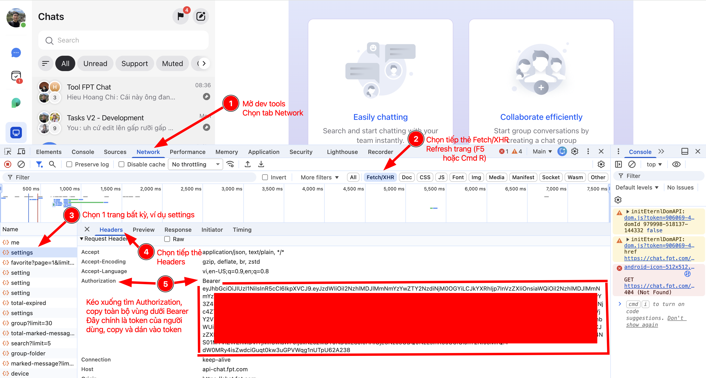

# FPT Chat ASM Report Tool

Công cụ phân tích báo cáo hàng ngày của ASM từ lịch sử chat nhóm FPT Chat — lọc shop theo đặt cọc, tổng hợp ý tưởng triển khai, điểm nổi bật, và kiểm tra ai chưa báo cáo.

---

## Cài đặt (dành cho người dùng không lập trình)

### Bước 1 — Cài Python

Tải Python tại **https://www.python.org/downloads** → chọn bản mới nhất → cài đặt.

> **Quan trọng**: Khi cài, tích vào ô **"Add Python to PATH"** trước khi nhấn Install.

Kiểm tra cài thành công: mở **Command Prompt** (Windows) hoặc **Terminal** (Mac), gõ:

```
python --version
```

Thấy hiện `Python 3.x.x` là thành công.

---

### Bước 2 — Tải công cụ

Tải toàn bộ thư mục công cụ về máy (hoặc nhận từ người gửi), giải nén ra một thư mục **không có dấu cách trong tên đường dẫn**.

| Hệ điều hành | Ví dụ đường dẫn hợp lệ |
|---|---|
| Windows | `C:\Tools\ASM-Report\` |
| Mac | `~/Desktop/ASM-Report/` hoặc `~/Documents/ASM-Report/` |

> **Lưu ý Mac**: Nếu thư mục đặt ở path có dấu cách (ví dụ `Hieu reporting`), file `chay_bao_cao.command` sẽ không chạy được khi double-click do giới hạn của Terminal.app macOS.

---

### Bước 3 — Cài thư viện (chỉ làm 1 lần)

**Windows** — Mở **Command Prompt**, chạy:

```
cd C:\Tools\ASM-Report
pip install -r requirements.txt
```

**Mac** — Mở **Terminal**, chạy:

```
cd ~/Desktop/ASM-Report
pip3 install -r requirements.txt
```

---

### Bước 4 — Chạy công cụ

- **Windows**: Double-click vào file **`chay_bao_cao.bat`**
- **Mac**: Double-click vào file **`chay_bao_cao.command`**

Trình duyệt sẽ tự mở trang web của công cụ. Điền token và Group ID rồi nhấn **Chạy phân tích**.

> Nếu trình duyệt không tự mở, mở thủ công và truy cập: **http://localhost:8501**

---

## Lấy token



1. Mở FPT Chat trên trình duyệt → nhấn **F12** mở DevTools → chọn tab **Network**
2. Chọn tiếp thẻ **Fetch/XHR** → nhấn **F5** (hoặc Cmd+R) để refresh trang
3. Chọn một request bất kỳ trong danh sách, ví dụ `settings`
4. Chọn tab **Headers** trong panel bên phải
5. Kéo xuống tìm dòng **Authorization** → sao chép toàn bộ phần sau chữ `Bearer ` (không lấy chữ Bearer)

> Token có thời hạn — nếu gặp lỗi `401 Unauthorized`, lấy lại token mới từ trình duyệt.

---

## Lấy Group ID

Group ID là chuỗi 24 ký tự hex, tìm trong URL khi mở nhóm chat trên trình duyệt:

```
https://chat.fpt.com/group/687d9b9b805279fc03d25365
                                  ^^^^^^^^^^^^^^^^^^^^^^^^
```

Có thể paste URL đầy đủ vào `config.json` — tool tự trích ID.

---

## Sử dụng

### Giao diện web (dành cho người dùng thông thường)

Double-click **`chay_bao_cao.bat`** (Windows) hoặc **`chay_bao_cao.command`** (Mac).

Trình duyệt mở ra, điền vào sidebar bên trái:
1. **Token** — lấy từ DevTools (xem hướng dẫn bên dưới)
2. **Group ID** — ID hoặc URL nhóm chat
3. Chọn **Hôm nay** hoặc khoảng ngày tuỳ chọn
4. Nhấn **▶ Chạy phân tích**
5. Xem kết quả và nhấn **⬇️ Tải báo cáo Excel**

---

### Dòng lệnh (dành cho người dùng kỹ thuật)

#### Phân tích hôm nay

```bash
python fpt_chat_stats.py --today
```

### Xuất Excel báo cáo hôm nay

```bash
python fpt_chat_stats.py --today --excel bao_cao.xlsx
```

### Lọc theo khoảng ngày

```bash
# Từ 1/4/2026 đến hết 16/4/2026
python fpt_chat_stats.py --from 2026-04-01 --to 2026-04-16

# Xuất kèm Excel
python fpt_chat_stats.py --from 2026-04-01 --to 2026-04-16 --excel bao_cao.xlsx
```

### Lưu và phân tích offline

```bash
# Lưu raw messages ra file (cần token + internet)
python fpt_chat_stats.py --save raw.json

# Phân tích từ file đã lưu (không cần token/internet)
python fpt_chat_stats.py --load raw.json --today --excel bao_cao.xlsx
```

---

## Output

### Báo cáo text (stdout)

```
=================================================================
  FPT CHAT - BÁO CÁO ASM
=================================================================

TỔNG QUAN===============================
  Khoảng thời gian : 2026-04-16 → 2026-04-16
  Báo cáo ASM      : 5

SHOP ĐẶT CỌC THẤP (< ngưỡng)============
  [  1 đặt cọc] Shop ABC  — Nguyen Van A

SHOP ĐẶT CỌC CAO (> ngưỡng)=============
  [  8 đặt cọc] Shop XYZ  — Tran Thi B

Ý TƯỞNG TRIỂN KHAI TỪ ASM===============
  1. [Nguyen Van A] Shop: ABC
     Triển khai combo mới, tăng trưng bày

ĐIỂM TÍCH CỰC===========================
  1. [Tran Thi B] Shop: XYZ
     Nhân viên chủ động, doanh thu tăng 20%

ĐIỂM HẠN CHẾ============================
  1. [Nguyen Van A] Shop: ABC
     Thiếu hàng tồn kho

ASM CHƯA BÁO CÁO========================
  - Le Van C
  - Pham Thi D
```

### Excel (4 sheet)

| Sheet | Nội dung |
|-------|----------|
| **Shop Đặt Cọc** | Tất cả shop với số đặt cọc, mức (Thấp/Bình thường/Cao), tên ASM |
| **Ý tưởng ASM** | Nội dung "Đã làm" từng ASM theo từng shop |
| **Điểm nổi bật** | Điểm tích cực và hạn chế từng ASM |
| **ASM chưa báo cáo** | Danh sách ASM chưa gửi báo cáo trước deadline |

---

## Tất cả tuỳ chọn

```
--config FILE          File config JSON (mặc định: config.json)
--token TOKEN          Token xác thực (ghi đè config)
--group GROUP          Group ID hoặc URL (ghi đè config)
--api-url URL          Base URL API (mặc định: https://api-chat.fpt.com)
--limit N              Số tin nhắn mỗi trang API (mặc định: 50)

--today                Phân tích hôm nay theo giờ VN (không dùng kèm --from/--to/--date)
--from YYYY-MM-DD      Chỉ phân tích từ ngày này (inclusive)
--to   YYYY-MM-DD      Chỉ phân tích đến ngày này (inclusive)
--date YYYY-MM-DD      Ngày kiểm tra compliance (mặc định: hôm nay giờ VN)

--excel FILE           Xuất báo cáo Excel .xlsx với 4 sheet ASM
--save FILE            Lưu raw messages ra JSON
--load FILE            Dùng file JSON thay vì gọi API

--deposit-low N        Ngưỡng đặt cọc thấp — shop có deposit < N (mặc định: 2)
--deposit-high N       Ngưỡng đặt cọc cao — shop có deposit > N (mặc định: 5)
--asm-deadline HH:MM   Deadline báo cáo hàng ngày (mặc định: 20:00, giờ VN)
--skip-reporters NAMES Tên cách nhau bằng dấu phẩy — loại khỏi compliance check
```

---

## Cấu hình nâng cao (config.json)

Tất cả giá trị có thể set trong `config.json` để không phải truyền flag mỗi lần:

```json
{
  "token": "...",
  "group": "...",
  "api_url": "https://api-chat.fpt.com",
  "asm_deposit_low": 2,
  "asm_deposit_high": 5,
  "asm_skip_reporters": ["Ten Truong Phong", "Ten Giam Doc"]
}
```

Thứ tự ưu tiên: **CLI flag > config.json > mặc định built-in**.

---

## Bảo mật

- `config.json` đã được thêm vào `.gitignore` — **không bao giờ commit file này**.
- Chỉ commit `config.example.json` (không chứa token thật).
